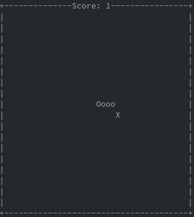

### Snake Game in your Terminal with Python3

This is a simple version of the traditional [snake game](https://en.wikipedia.org/wiki/Snake_(video_game_genre)) written in python3, using the curses library.



---


#### Setup
```bash
git clone https://github.com/jacarvalho/snake
cd snake
python3 setup.py install
```

---

#### Play

##### Run

```bash
python3 snake
```

##### Instructions

```
- Move the snake with the ARROW keys
- Collect the 'food', indicated by 'X'
- The game ends if the snake hits itself or the wall
- To quit the game earlier press 'q'
```

---

#### Test and checkstyle

```bash
make
```


